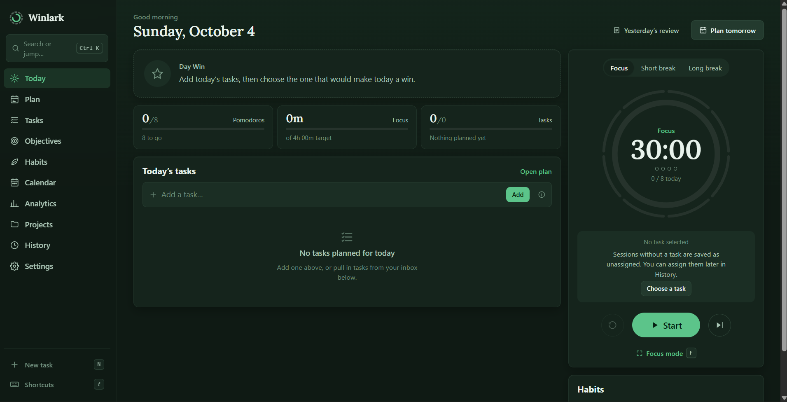
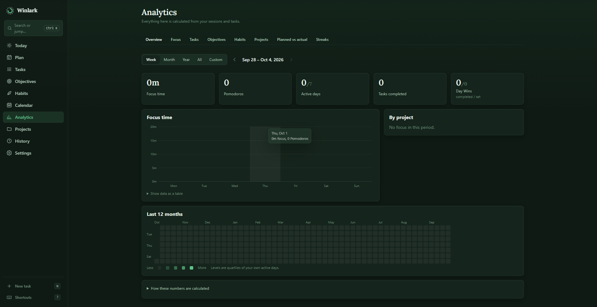

# Winlark

**Plan your day, protect your focus, review what happened.**
An offline-first Pomodoro planner that runs entirely in your browser: no account, no server, no tracking.

**Live app:** [winlark](https://winlark.pranavlabs.workers.dev/) 

### Preview Images





Winlark is built around one loop: **plan → focus → execute → review**. You choose one task as the
day's **Day Win**, work through Pomodoro sessions, and at the end compare what you planned with what
actually happened. It is plain HTML, CSS and JavaScript (ES modules). There is no framework, no build
step and no external requests.

## Features

- **Day Win.** One task per day that would make the day a win. Unfinished days read "Not completed",
  never "failed".
- **Timer that survives reality.** Based on timestamps, so refreshing, sleeping or switching tabs
  cannot make it drift. A session that ended while the app was closed is recorded once on return.
- **Plan view.** Workload gauge (Light / Moderate / Heavy) against your daily focus target, reordering
  by drag or keyboard, and a rule-based planning assistant that suggests but never changes anything
  without asking.
- **Planned vs Actual.** Original estimates are never overwritten, so you can see how your estimates
  compare with reality over time.
- **Tasks that keep their history.** Moving a task records where it came from; the original day still
  shows it as moved. Repeating tasks create one independent copy per day.
- **Objectives, habits, projects** and **custom streaks** (daily or weekly, on the days you choose).
- **Analytics.** Eight tabs with real charts, a year heatmap and a calendar. Every number is derived
  from your recorded sessions and tasks, and there is a "How this is calculated" note.
- **Daily review** with your own reflections. There is no productivity score.
- **Focus mode**, a **command palette** (Ctrl/⌘+K), keyboard shortcuts, ten themes, alarm sounds and
  synthesized ambient sounds (rain, café, fire, waves and more).
- **Offline and installable** as an app on desktop and mobile.
- **Your data stays on your device**, with versioned JSON export and import (merge or replace), and
  automatic safety copies before every import.

## Quick start

```bash
git clone https://github.com/pranav-mahure/winlark.git
cd winlark
npx serve .          # or: python3 -m http.server 8000
```

Open the printed address, for example `http://localhost:3000`. It has to be served over http(s);
opening `index.html` from disk will not work, because ES modules and the service worker need a web
origin.

> **Tip:** always open the app at the same address. Browser storage is kept per address, so
> `localhost:3000`, `localhost:3001` and `127.0.0.1:3000` each have their own separate data.

### Install on your phone or computer

Use the hosted HTTPS version. **Android (Chrome):** menu → *Install app*. **iPhone (Safari):** Share →
*Add to Home Screen*. Once installed it opens like a normal app and works offline.

## Your data

- Everything is stored in your browser's **IndexedDB** (database `pomofocus`). Nothing is sent
  anywhere.
- Data lives **per browser and per device**. There is no sync. Clearing site data, switching browsers
  or opening a different address starts you with an empty app unless you import a backup.
- **Export regularly** from *Settings → Data → Export* and keep the file somewhere outside the browser.
  The same file moves your data to another device (*Import a backup… → Merge*).
- Safety copies made before imports are stored in the same browser, so they are not a replacement for
  an exported backup.

## Coming from PomoFocus 1.x

Winlark was built as the successor to a single-file Pomodoro app called PomoFocus 1.x and can bring
its data across.

- **Same browser:** if the old app's data (localStorage key `pomofocus_data`) is found, Winlark offers
  to convert it. A raw copy is saved first, a preview with self-checks is shown, and the old data is
  not deleted until you remove it yourself.
- **From an export file:** *Settings → Data → Import a backup…* accepts 1.x exports as well as
  Winlark backups, including backups made before the app was renamed.
- Importing the same file twice changes nothing.

Tested against a real export: lifetime Pomodoros, lifetime focus minutes and the per-day and
per-project totals matched the original app exactly, and the current streak matched too.

## Keyboard shortcuts

| Key | Action |
| --- | --- |
| `Space` | Start / pause |
| `S` | Skip to the next phase |
| `Shift` + `R` | Reset |
| `F` | Focus mode |
| `Esc` | Exit focus mode / close dialog or menu |
| `N` | New task |
| `Ctrl/⌘` + `K` or `/` | Command palette |
| `?` | Shortcut help |
| `G` then `T` `P` `K` `O` `H` `C` `A` `J` `Y` | Go to a page |
| `Alt` + `↑` / `↓` | Move the focused task up or down |

Shortcuts are ignored while typing in a field.

**Quick add** understands shortcuts in the task title: `~3` estimate, `!h` `!m` `!l` priority,
`#tag`, `+Project`, `@tomorrow` `@fri` `@oct 3` `@none` for the day, and `*` to make it the Day Win.
Example: `Draft report ~2 !h +Work *`

## Project structure

```
winlark/
│
├── index.html
├── manifest.json
├── service-worker.js
├── _headers
├── README.md
│
├── css/
│   ├── reset.css
│   ├── variables.css
│   ├── themes.css
│   ├── base.css
│   ├── layout.css
│   ├── components.css
│   ├── views.css
│   └── responsive.css
│
├── js/
│   ├── app.js
│   │
│   ├── core/
│   │   ├── constants.js
│   │   ├── events.js
│   │   └── state.js
│   │
│   ├── storage/
│   │   ├── db.js
│   │   ├── repository.js
│   │   ├── migration.js
│   │   ├── backup.js
│   │   └── snapshots.js
│   │
│   ├── features/
│   │   ├── timer.js
│   │   ├── sessions.js
│   │   ├── tasks.js
│   │   ├── objectives.js
│   │   ├── daily-plan.js
│   │   ├── habits.js
│   │   ├── streaks.js
│   │   ├── projects.js
│   │   ├── analytics.js
│   │   ├── insights.js
│   │   ├── review.js
│   │   ├── calendar.js
│   │   ├── settings.js
│   │   ├── audio.js
│   │   └── notifications.js
│   │
│   ├── ui/
│   │   ├── router.js
│   │   ├── render.js
│   │   ├── actions.js
│   │   ├── modals.js
│   │   ├── dialogs.js
│   │   ├── toasts.js
│   │   ├── charts.js
│   │   ├── command-palette.js
│   │   ├── shortcuts.js
│   │   ├── drag-drop.js
│   │   ├── focus-mode.js
│   │   ├── task-dialogs.js
│   │   └── icons.js
│   │
│   ├── views/
│   │   ├── today.js
│   │   ├── plan.js
│   │   ├── tasks.js
│   │   ├── objectives.js
│   │   ├── habits.js
│   │   ├── calendar.js
│   │   ├── analytics.js
│   │   ├── projects.js
│   │   ├── history.js
│   │   ├── review.js
│   │   └── settings.js
│   │
│   └── utils/
│       ├── dates.js
│       ├── formatting.js
│       ├── ids.js
│       ├── dom.js
│       └── validation.js
│
├── assets/
│   ├── icons/
│   └── fonts/
│       ├── Lora-*.woff2
│       └── OFL.txt
│
└── tests/
    ├── migration.test.mjs
    ├── features.test.mjs
    ├── render.test.mjs
    ├── e2e.py
    └── e2e_flows.py
```

## Architecture in short

- **Storage.** One IndexedDB object store per collection. All writes go through `commit({ put, del })`,
  which saves first, then updates memory, and returns the inverse change set that powers Undo.
- **Repository interface.** Feature code never touches IndexedDB directly. A different backend (for
  example an HTTP API) only needs a class with `getAll`, `get`, `count`, `bulkWrite` and `clear`.
  The planned mapping is documented in `js/storage/repository.js`.
- **Sessions are the source of truth.** A Pomodoro is a completed focus session. Daily totals, project
  time, task actuals, streaks and charts are all derived from sessions and tasks, so they can always
  be recalculated.
- **UI.** Views return HTML strings, re-rendered in batches while keeping focus. Behaviour is attached
  with `data-action` attributes and delegated listeners. All user text is escaped.
- **Service worker.** Cache-first for the app shell. Responses are stored without their "redirected"
  flag, because Chrome rejects redirected responses for page navigations and some static servers
  (including `npx serve`) redirect `/index.html`. User data is never cached there. When you deploy a
  change, bump `CACHE_VERSION` in `service-worker.js`.

## Testing

```bash
# Node (no browser)
node tests/migration.test.mjs   path/to/pomofocus-1x-export.json
node tests/features.test.mjs    path/to/pomofocus-1x-export.json
node tests/render.test.mjs      path/to/pomofocus-1x-export.json
node tests/rename.test.mjs      path/to/pomofocus-1x-export.json

# Browser (Playwright for Python + Chromium), with a static server on port 8765
python3 -m http.server 8765 &
python3 tests/e2e.py path/to/pomofocus-1x-export.json
python3 tests/e2e_flows.py
python3 tests/sw_redirect_test.py .
```

The migration tests need a PomoFocus 1.x export file, which is personal data and is not included in
this repository. You can also set its path once with `POMO_LEGACY=path/to/file.json`. Date-dependent
tests expect your local time zone; they were developed with `TZ=Asia/Kolkata`.

## Deploying

It is a static site, so any static host works. Netlify and Cloudflare Pages / Workers both have free
tiers. The `_headers` file is read by both. Use HTTPS, which the service worker and installation need.
The app uses relative paths, so it can also live under a sub-path.

## Browser support and known limitations

- Automated tests ran in **Chromium** only, including emulated phone widths and mouse-driven drag.
  Safari, Firefox, real touch devices and screen readers have not been tested yet. Bug reports from
  those are welcome.
- Browsers throttle timers in background tabs, so an end-of-session alert can arrive up to about a
  minute late there. Recorded times stay exact because they come from timestamps.
- Notifications are local only, with no push, and need the browser to be running.
- Audio needs one click or key press first (a browser rule). Ambient sounds are synthesized, not
  recordings.
- Sessions imported from PomoFocus 1.x have dates but no time of day, because the old app never
  recorded one.

## Contributing

Issues and pull requests are welcome. Please keep the project dependency-free (no frameworks or
build step), run the test suites above before opening a pull request, and never change the IndexedDB
schema without a tested upgrade path, because real users' data lives there.

## License

[**MIT LICENSE**](<MIT LICENSE>)


## Credits

The bundled [Lora](https://fonts.google.com/specimen/Lora) font is licensed under the SIL Open Font
License (see `assets/fonts/OFL.txt`).
